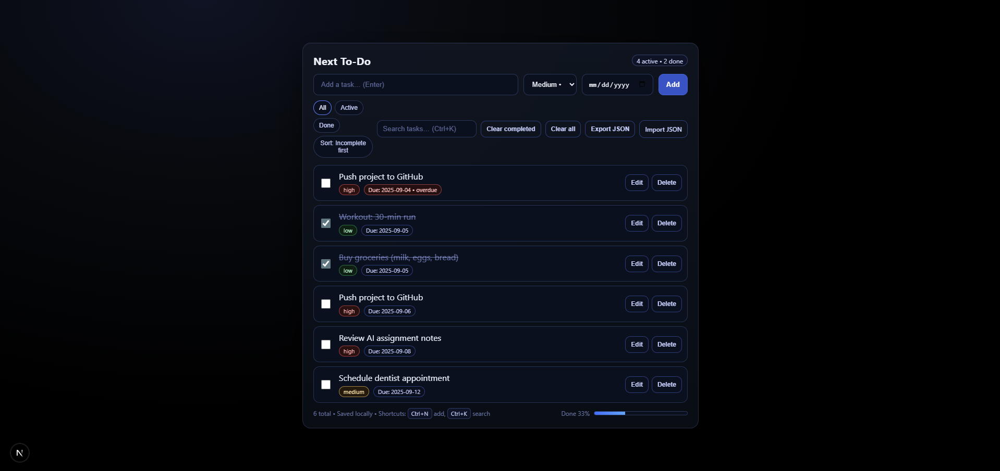

# Next.js To-Do App

A clean, modern **To-Do app** built with [Next.js](https://nextjs.org/) using the **App Router**.  
Features a dark aesthetic design, priorities, due dates, search, filters, and JSON export/import.  

---

## ✨ Features

- Add tasks with **text, priority, and due date**  
- Mark tasks ✅ complete / ⏳ active  
- Edit or Delete tasks  
- Search (case-insensitive, real-time)  
- Filters: All • Active • Done  
- Sort option: Incomplete first  
- Stats bar with completion % and progress bar  
- Due date highlighting (overdue shown in red)  
- Priorities: Low • Medium • High  
- Local persistence with `localStorage`  
- Export / Import tasks as JSON  
- Keyboard shortcuts:  
  - `Ctrl + N` → focus Add box  
  - `Ctrl + K` → focus Search  

---

## 📸 Screenshots



---

## 🚀 Getting Started

Clone & run locally:

```bash
git clone https://github.com/rusafidt/next-todo.git
cd next-todo
npm install
npm run dev
```
Then open http://localhost:3000/

---

## 🧑‍💻 About

This project was built to practice React + Next.js fundamentals:
- State management with hooks
- Client components in App Router
- Filtering, sorting, and persistence
- Clean UI with custom CSS
